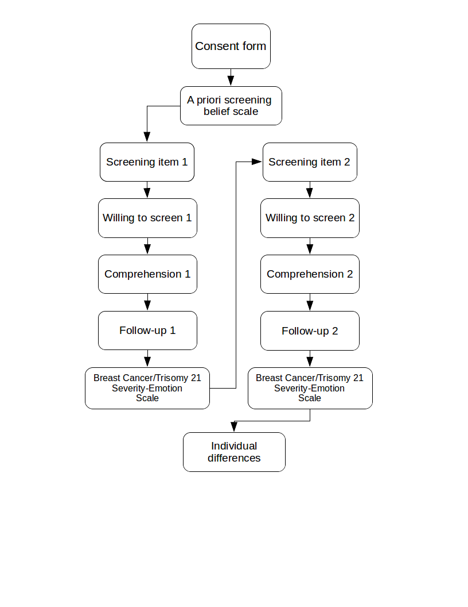

# Bayes Summary

```{r, results='asis', echo=FALSE}
cat("")
```

## A priori belief
```{r, results='asis', echo=FALSE}
# PRINT SCALES (BOOK)
# this vector with paths set the scales to be printed
scales2print <- c("materials/qualtrics/output/plain_text/scales/apriori_belief/") 

source("scripts/print_scales.R")
```

## Screening item
```{r, results='asis', echo=FALSE}
display_item(c("pr", "fbpi", "high", "sg"))
display_item(c("pr", "nfab", "high", "ss"))
display_item(c("pr", "prre", "high", "gi"))
display_item(c("ca", "prab", "low", "gs"))
display_item(c("ca", "pfab", "low", "sg"))
display_item(c("ca", "nppi", "low", "gs"))
```

## Willing to screen  

```{r, results='asis', echo=FALSE}
will_screening <- 
  "materials/Question/willing_screen/willing_screen.txt" %>% 
  readChar(., file.size(.))

will_screening %>% 
    gsub("\\[{2}ID\\:([a-zA-Z_0-9]*)\\]{2}", "**\\1**", .) %>%        # question ID
    gsub('<span style="font-size\\:[0-9]{2}px;">', "", .) %>%     # remove html tag
    gsub('</span>', "", .) %>%  # remove html tag
    gsub("\\[{2}Question.*?\\]{2}\\n", "", .) %>% # remove Question qualtrics format 
    gsub("\\[{2}Choices\\]{2}\\n", "", .) %>%  # remove choices qualtrics format 
    gsub("\\n", "\n\n", .) %>% # double linebreaks because bookdown is weird
    gsub("DELETE_THIS", "", .) %>%  # remove DELETE_THIS
cat()
```

## Comprehension

```{r, results='asis', echo=FALSE}
# fillers
comp_01 <- filter(fillers, field_name == "comp_01") %>% select("ca", "pr") %>% paste(., collapse = "/")
comp_02 <- filter(fillers, field_name == "comp_02") %>% select("ca", "pr") %>% paste(., collapse = "/")

"materials/qualtrics/output/plain_text/comprehension/comprehension.txt" %>% 
  readChar(., file.size(.)) %>% 
  # Clean
  gsub("\\[{2}Question.*?\\]{2}", "", .) %>% # remove question qualtrics tag
  gsub("\\[{2}ID\\:(.*?)\\]{2}", "**\\1**", .) %>%  # remove question id qualtrics tag
  gsub("<.*?>", "", .) %>% # remove html font size tag
  gsub("\\[{2}Choices\\]{2}", "", .) %>% # remove choices qualtrics tag
  gsub("\n{0,1}delete_this\n{0,1}", "", .) %>%  # remove delete_this text for empty sliders
  gsub("\n", "  \n", .) %>% # add two empty spaces to format linebreaks in markdown
  
  # Fill placeholders
  gsub("\\$.*?comp_01_0\\}", comp_01, .) %>% 
  gsub("\\$.*?comp_02_0\\}", comp_02, .) %>% 
  
  cat()


```

## Follow-up
```{r, results='asis', echo=FALSE}
source("scripts/print_followup.R")
```

## Breast cancer/Trisomy 21 Severity-emotion Scale
```{r, results='asis', echo=FALSE}
# PRINT SCALES (BOOK)
# this vector with paths set the scales to be printed
scales2print <- c("materials/qualtrics/output/plain_text/scales/severity_emotion/partial") 

source("scripts/print_scales.R")
```

